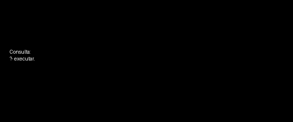

# Conceitos de Unificação e Backtracking no Processamento de Consultas em Prolog

No Prolog, o processamento de consultas (queries) é baseado em dois conceitos fundamentais: **unificação** e **backtracking**. Esses mecanismos trabalham em conjunto para encontrar soluções a partir de uma base de conhecimento composta por fatos e regras.

---

## Unificação

A **unificação** é o processo de tornar dois termos iguais, encontrando valores adequados para suas variáveis.

Em outras palavras, o Prolog verifica se uma consulta pode casar (matching) com um fato ou regra existente na base de conhecimento.

### Exemplo

```prolog
pai(joao, maria).
```

Consulta:

```prolog
?- pai(joao, X).
```

### Funcionamento

* O Prolog tenta unificar `pai(joao, X)` com `pai(joao, maria)`
* Como os termos são compatíveis, ocorre a unificação:

```
X = maria
```

---

### Outro exemplo

```prolog
gosta(X, pizza).
gosta(maria, Y).
```

Consulta:

```prolog
?- gosta(maria, pizza).
```

O Prolog encontra múltiplas unificações possíveis:

* `gosta(X, pizza)` → X = maria
* `gosta(maria, Y)` → Y = pizza

Isso mostra que uma consulta pode ter mais de uma solução válida.

---

## Backtracking

O **backtracking** é o mecanismo que o Prolog utiliza para explorar automaticamente diferentes possibilidades quando:

* uma tentativa falha, ou
* existem múltiplas soluções possíveis

---

### Fluxo de execução

```
Tenta uma solução  
↓  
Se falhar → volta atrás (backtracking)  
↓  
Tenta outra possibilidade  
↺ (repete até encontrar solução ou esgotar opções)
```

---

### Exemplo prático

```prolog
% Base de conhecimento
cor(azul).
cor(vermelho).
cor(verde).

% Predicado principal
executar :-
    cor(X),
    write('Tenta uma solução: '), write(X), nl,
    falha_ou_sucesso(X).

% Simula tentativa que pode falhar
falha_ou_sucesso(azul) :-
    write('Falhou → backtracking'), nl,
    fail.  % força o Prolog a voltar atrás

falha_ou_sucesso(vermelho) :-
    write('Falhou → backtracking'), nl,
    fail.

falha_ou_sucesso(verde) :-
    write('Sucesso!'), nl.
```

---

### Execução

```prolog
?- executar.
```

### Saída esperada

```
Tenta uma solução: azul
Falhou → backtracking
Tenta uma solução: vermelho
Falhou → backtracking
Tenta uma solução: verde
Sucesso!
```

---

## Relação entre Unificação e Backtracking

Esses dois conceitos atuam juntos durante a execução:

1. O Prolog tenta unificar a consulta com fatos e regras
2. Se houver múltiplas possibilidades, ele guarda alternativas
3. Caso uma tentativa falhe, entra em backtracking
4. O processo continua até encontrar uma solução ou esgotar todas as opções

---

## Resumo

| Conceito     | Função                                                  |
| ------------ | ------------------------------------------------------- |
| Unificação   | Associa valores às variáveis para tornar termos iguais  |
| Backtracking | Explora automaticamente diferentes caminhos de execução |




### Parte prática
```prolog
actor(1, song_kang_ho).
actor(1, lee_sun_kyun).

genre(1, drama).

drama_actor(A) :- actor(M, A), genre(M, drama).
```

### Consulta
```
?- drama_actor(A).
```

### Palavras-chave do trace:
Call -> tentativa de executar um objetivo<br>
Exit -> unificação foi bem sucedida<br>
Redo -> Backtracking<br>


### Fontes
https://www.dai.ed.ac.uk/groups/ssp/bookpages/quickprolog/node11.html<br>
https://www.tutorialspoint.com/prolog/prolog_backtracking.htm

